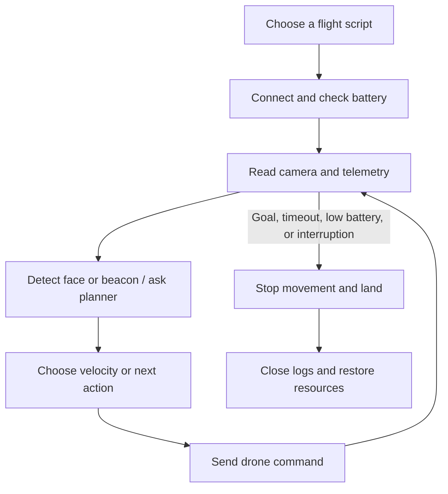

# A human guide to the Tello project

This repository contains several ways to control a small Tello drone. They share camera, planning, light-beacon, telemetry, and safety helpers, but they are separate programs rather than one mandatory pipeline.

[`drone.py`](drone.py) exposes basic commands. [`follow.py`](follow.py) uses face detection to adjust movement. [`kitchen_simple.py`](kitchen_simple.py) implements a beacon mission: prepare lights, fly toward magenta, pause, make a timed turn intended to face home, then fly forward toward cyan and land. The turn is open-loop timing, not a measured 180-degree rotation. Other mission scripts explore different control approaches.

The main `run` function in `kitchen_simple.py` keeps sending velocity commands while asynchronous perception requests complete. Fast color-pixel counts can slow or stop the approach; model answers provide another arrival signal. This prevents a slow model response from blocking the command loop.

[`lib/hue_beacon.py`](lib/hue_beacon.py) controls the beacons. [`lib/safety.py`](lib/safety.py) contains reusable landing behavior; some scripts also define their own cleanup. [`lib/telemetry.py`](lib/telemetry.py) records events. [`tello_dock/`](tello_dock/) is separate dock-controller firmware.

Read the specific script you intend to understand, then its imports under `lib/`. In a mission, trace the battery check, normal loop, timeout, signal handler, and `finally` cleanup together. These programs can move real hardware and change lights. The existence of a fallback landing path does not establish that a flight is safe in a particular room.
